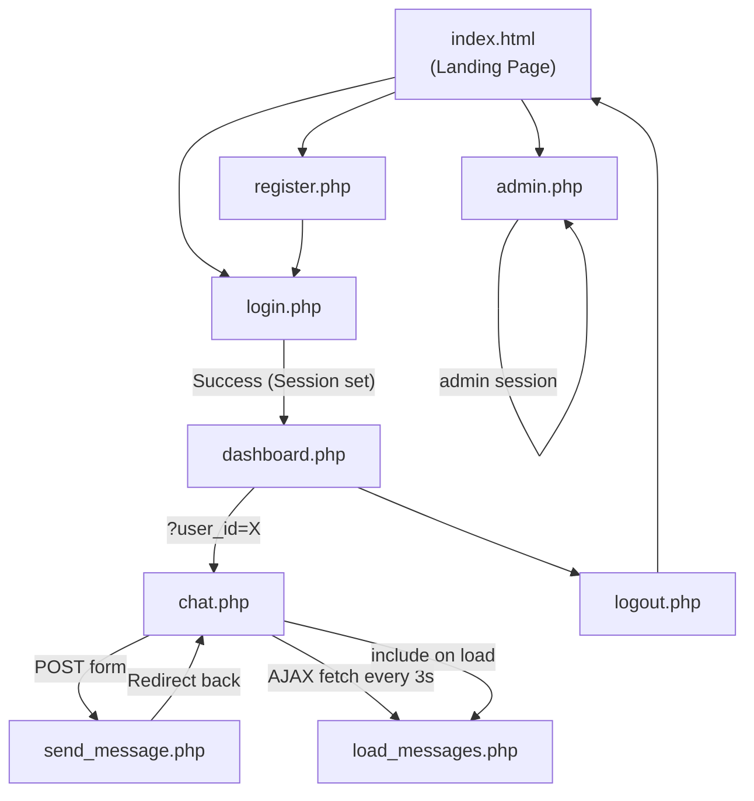

# Student Relationship System — Full Codebase Documentation

> **Project Location:** `c:\xampp\htdocs\Relationship_System\`
> **Stack:** PHP 7+, MySQL, HTML5, CSS3, Vanilla JavaScript
> **Server:** XAMPP (Apache + MySQL)

---

## 1. System Overview

The **Student Relationship System** is a web application that allows students to register, log in, discover other students who share the same department or interests, and send private chat messages to each other. An administrator can log in to a separate panel to monitor all students and messages, and delete either if needed.

### Key Features
| Feature | Description |
|---|---|
| Student Registration | New students create an account with name, email, password, department, and interests |
| Secure Login | Email + password authentication with `password_hash` / `password_verify` |
| Smart Matching | Dashboard shows other students who share the same department OR similar interests |
| Private Messaging | One-on-one chat with real-time auto-refresh every 3 seconds via AJAX |
| Admin Panel | Separate login for admin to view and delete students and messages |

---

## 2. File Structure

```
Relationship_System/
│
├── index.html              ← Public landing/home page
├── register.php            ← Student registration form + logic
├── login.php               ← Student login form + logic
├── logout.php              ← Session destroy + redirect
├── dashboard.php           ← Student home after login (shows matches)
├── chat.php                ← Private chat interface
├── send_message.php        ← Handles sending a message (POST endpoint)
├── load_messages.php       ← Loads chat messages (used by AJAX + includes)
├── admin.php               ← Admin login + admin control panel
├── db.php                  ← Database connection (shared by all PHP files)
├── schema.sql              ← SQL to create the database and tables
│
└── assets/
    └── style.css           ← Global stylesheet used by every page
```

---

## 3. Database Layer

### `schema.sql` — Database Blueprint

This file is run **once** in phpMyAdmin (or MySQL CLI) to set up the database. It is not executed by PHP at runtime.

```sql
CREATE DATABASE IF NOT EXISTS relationship_system;
USE relationship_system;
```
Creates the database if it doesn't already exist.

#### Table: `students`
```sql
CREATE TABLE IF NOT EXISTS students (
    id INT AUTO_INCREMENT PRIMARY KEY,
    name VARCHAR(100),
    email VARCHAR(100) UNIQUE,   -- prevents duplicate accounts
    password VARCHAR(255),       -- stores bcrypt hash, never plaintext
    department VARCHAR(100),
    interests TEXT               -- comma-separated string, e.g. "coding, music"
);
```

#### Table: `messages`
```sql
CREATE TABLE IF NOT EXISTS messages (
    id INT AUTO_INCREMENT PRIMARY KEY,
    sender_id INT,               -- foreign key → students.id
    receiver_id INT,             -- foreign key → students.id
    message TEXT,
    created_at TIMESTAMP DEFAULT CURRENT_TIMESTAMP
);
```

#### Table: `admin`
```sql
CREATE TABLE IF NOT EXISTS admin (
    id INT AUTO_INCREMENT PRIMARY KEY,
    username VARCHAR(50),
    password VARCHAR(255)        -- also bcrypt hashed
);

-- Seeds default admin user: username=admin, password=vasco123
INSERT INTO admin (username, password) VALUES ('admin', '$2y$10$...');
```

> [!IMPORTANT]
> The `admin` table is pre-seeded with one admin account. The password is stored as a bcrypt hash (not plaintext). Default credentials: **username:** `admin` | **password:** `vasco123`

---

### `db.php` — Database Connection (Shared Resource)

```php
<?php
$host   = "localhost";
$user   = "root";
$pass   = "";
$dbname = "relationship_system";

$conn = new mysqli($host, $user, $pass, $dbname);

if ($conn->connect_error) {
    die("Connection failed: " . $conn->connect_error);
}
?>
```

**How it works:**
- Creates a `$conn` object using PHP's `mysqli` extension.
- If the connection fails, the script stops immediately with an error message.
- Every other PHP file starts with `require 'db.php';` — this makes `$conn` available everywhere without duplicating code.

**Links to:** Every PHP file in the project.

---

## 4. Frontend Foundation

### `assets/style.css` — Global Stylesheet

Shared by **every** page via `<link rel="stylesheet" href="assets/style.css">`.

| CSS Rule | Purpose |
|---|---|
| `* { box-sizing: border-box; font-family: Segoe UI... }` | Global reset, consistent font |
| `body { background: #f0f8ff; display: flex; flex-direction: column; }` | Light blue background, full-height layout |
| `header { background: #ff2600; ... }` | Red top navigation bar |
| `.container { max-width: 1000px; margin: auto; ... }` | Centered white card for page content |
| `.btn` | Blue action button (used for Login, Register, Send, Message) |
| `.btn-danger` | Red delete button (used in admin panel) |
| `.form-group` | Wraps label + input pairs for consistent spacing |
| `.match-card` | Card layout for student suggestion rows on the dashboard |
| `.messages` | Scrollable chat message box |
| `.message` | Individual chat bubble (received = light blue) |
| `.message.sent` | Chat bubble for messages you sent (aligned right, darker blue) |
| `table, th, td` | Admin panel table styling |
| `.chat-sidebar a.active` | Highlighted sidebar link for currently selected chat recipient |

---

## 5. Page-by-Page Code Explanation

---

### `index.html` — Landing Page

**Type:** Static HTML (no PHP)

**Purpose:** The entry point of the application. Shown to visitors who are not logged in.

**What it does:**
- Displays a welcome message and a brief description of the system.
- Provides two prominent buttons: **Get Started** (→ `register.php`) and **Login** (→ `login.php`).
- The navigation bar includes links to Login, Register, and Admin.

**No server-side logic** — it is a pure static file.

**Links to:** `register.php`, `login.php`, `admin.php`, `assets/style.css`

---

### `register.php` — Student Registration

**Type:** PHP (form + logic)

**How it works step-by-step:**

1. **Session & DB start:** `session_start()` and `require 'db.php'` run first.
2. **Form submission check:** When the form is submitted via POST:
   - All fields (`name`, `email`, `password`, `department`, `interests`) are collected and trimmed.
   - If any required field is empty → sets `$error` message.
   - Checks if the email already exists in `students` table using a prepared statement.
   - If email is taken → sets `$error`.
   - If email is free → hashes the password with `password_hash($password, PASSWORD_DEFAULT)` (bcrypt).
   - Inserts the new student into `students` table.
   - Sets `$success` message on success.
3. **HTML Form rendered:** Displays feedback messages (`$error` in red, `$success` in green), then the registration form.

**Department options available:** Computer Science, Engineering, Business, Medicine, Arts.

**Security features:**
- Password is **never stored in plaintext**.
- Uses **prepared statements** to prevent SQL injection.

**Links to:** `db.php`, `login.php`, `assets/style.css`

---

### `login.php` — Student Login

**Type:** PHP (form + logic)

**How it works step-by-step:**

1. `session_start()` → if the student is already logged in (`$_SESSION['student_id']` exists), they are immediately redirected to `dashboard.php`.
2. On POST submission:
   - Collects `email` and `password` from the form.
   - Validates that both fields are non-empty.
   - Queries `students` WHERE `email = ?` using a prepared statement.
   - If a matching user is found: `password_verify($password, $row['password'])` compares the input against the stored hash.
   - On success: saves `student_id` and `student_name` into `$_SESSION`, then redirects to `dashboard.php`.
   - On failure: sets an appropriate `$error` message.
3. **HTML Form** is rendered with the error message (if any).

**Security features:**
- Prepared statements (no SQL injection).
- `password_verify()` for secure hash comparison.
- Already-logged-in redirect prevents duplicate sessions.

**Links to:** `db.php`, `dashboard.php`, `register.php`, `assets/style.css`

---

### `logout.php` — Session Termination

**Type:** PHP (logic only, no HTML output)

**How it works:**
```php
session_start();     // resume existing session
session_unset();     // clear all session variables
session_destroy();   // destroy the session on the server
header("Location: index.html");  // send user back to home
exit();
```

This is a **utility script** — it has no HTML. Any link to `logout.php` ends the session and redirects immediately.

**Links to:** `index.html`

---

### `dashboard.php` — Student Dashboard (After Login)

**Type:** PHP (logic + HTML)

**How it works step-by-step:**

1. **Auth guard:** If `$_SESSION['student_id']` is not set → redirect to `login.php`. This protects the page from unauthenticated access.
2. **Fetch current student's profile** from the `students` table (name, department, interests).
3. **Match Algorithm:**
   - Splits the student's `interests` string by comma into an array.
   - Builds a dynamic SQL `WHERE` clause: for each interest, adds `interests LIKE '%keyword%'`.
   - Combines them with `OR`.
   - Final query finds all other students (`id != $student_id`) who share the **same department** OR have **any matching interest**, limited to 20 results.
4. **Renders:**
   - A **profile section** showing the logged-in student's department and interests.
   - A list of **match cards** — each showing a matched student's name, department, interests, and a **Message** button linking to `chat.php?user_id=<id>`.
   - If no matches, shows a "No matches found" message.

**Links to:** `db.php`, `login.php`, `chat.php`, `logout.php`, `assets/style.css`

---

### `chat.php` — Private Chat Interface

**Type:** PHP + JavaScript (AJAX auto-refresh)

**How it works step-by-step:**

1. **Auth guard:** Redirects to `login.php` if not logged in.
2. **Reads URL parameter:** `?user_id=<id>` — identifies the person you want to chat with (`$receiver_id`).
3. **Fetches sidebar list:** All other students (except current user), ordered alphabetically, to populate the left sidebar.
4. **Fetches receiver details:** If a valid `user_id` is in the URL, looks up that student's name.

**HTML Layout — Two Panels:**
- **Left sidebar:** List of all students. Clicking a name sets `?user_id=` in the URL. The active user's link is highlighted with the `.active` CSS class.
- **Main chat area:**
  - If a receiver is selected: shows the chat header, the message box (loaded via `load_messages.php`), and a send form.
  - If no receiver is selected: shows "Select a student to start chatting."

**JavaScript Auto-Refresh (AJAX):**
```javascript
setInterval(function() {
    fetch('load_messages.php?user_id=<?php echo $receiver_id; ?>')
        .then(response => response.text())
        .then(html => {
            chatBox.innerHTML = html;
            // Only auto-scroll if user was already at the bottom
        });
}, 3000);  // polls every 3 seconds
```
This keeps the chat live **without a full page reload**.

**Initial message load:** On first page load, `load_messages.php` is included directly with `<?php include 'load_messages.php'; ?>` — this renders the chat history server-side.

**Send form:** Posts to `send_message.php` with `receiver_id` (hidden) and `message` (text input).

**Links to:** `db.php`, `load_messages.php`, `send_message.php`, `dashboard.php`, `logout.php`, `assets/style.css`

---

### `load_messages.php` — Message Loader (Dual-Use)

**Type:** PHP (outputs HTML fragments)

**Purpose:** Retrieves and renders the message history between two users. This file is used in **two ways**:
1. **Included directly** in `chat.php` for the initial server-side render.
2. **Called via AJAX** (the `fetch()` in `chat.php`'s JavaScript) for live refresh.

**How it handles both contexts:**
```php
if (session_status() === PHP_SESSION_NONE) {
    session_start();   // only starts session if not already started
}
if (!isset($conn)) {
    require 'db.php';  // only connects if connection doesn't already exist
}
```

**Query Logic:**
- Fetches all messages WHERE `(sender=me AND receiver=them) OR (sender=them AND receiver=me)`.
- Orders by `created_at ASC` (oldest first = natural conversation order).
- Each message `<div>` has class `message` (received) or `message sent` (sent by current user).
- Long hover: timestamp is shown in the `title` attribute (hover tooltip).

**Links to:** `db.php` (conditionally), sessions

---

### `send_message.php` — Message Submission Handler

**Type:** PHP (logic only, no HTML)

**How it works:**
1. Auth guard: redirect if not logged in.
2. Checks request is POST with both `message` and `receiver_id`.
3. Sanitizes: `intval()` on `receiver_id`, `trim()` on `message`.
4. Validates: message is not empty, receiver exists and isn't the current user.
5. Inserts into `messages` table using a prepared statement.
6. Redirects back to: `chat.php?user_id=<receiver_id>` to continue the conversation.

**Why POST-then-redirect?** This follows the **Post/Redirect/Get (PRG)** pattern — prevents the browser from re-submitting the form on page refresh.

**Links to:** `db.php`, `chat.php`

---

### `admin.php` — Administrator Control Panel

**Type:** PHP (logic + HTML — all in one file)

**This file handles three responsibilities in a single file:**

#### A. Admin Logout (GET action)
```php
if (isset($_GET['action']) && $_GET['action'] == 'logout') {
    unset($_SESSION['admin_logged_in']);
    header("Location: admin.php");
    exit();
}
```
Clears only the admin session variable (not the student session).

#### B. Admin Login (POST)
- Compares submitted username against the `admin` table.
- Uses `password_verify()` for the password hash comparison.
- On success: sets `$_SESSION['admin_logged_in'] = true`.

#### C. Admin Deletions (GET with ID)
- `?delete_user=<id>` — Deletes the student from `students` AND all their messages from `messages` (cascading cleanup).
- `?delete_message=<id>` — Deletes a single message by ID.
- Both require `$_SESSION['admin_logged_in'] === true` before executing.

#### D. HTML Dashboard (if logged in as admin)
- **Students Table:** Lists all students with ID, name, email, department, interests, and a Delete button (with JS `confirm()` prompt).
- **Messages Table:** Shows last 50 messages with sender/receiver names (uses `LEFT JOIN` to handle deleted users gracefully — shows "Deleted User" if the student no longer exists), and a Delete button.

**Links to:** `db.php`, `index.html`, `assets/style.css`

---

## 6. How All Files Link Together

### Navigation Flow



### Shared Dependencies

```
db.php  ←── required by: register.php, login.php, dashboard.php,
                          chat.php, send_message.php, load_messages.php, admin.php

assets/style.css ←── linked by: index.html, register.php, login.php,
                                 dashboard.php, chat.php, admin.php
```

### Session Variables Used

| Variable | Set By | Used By | Means |
|---|---|---|---|
| `$_SESSION['student_id']` | `login.php` | `dashboard.php`, `chat.php`, `send_message.php`, `load_messages.php` | Student is logged in |
| `$_SESSION['student_name']` | `login.php` | (optional reference) | Display name |
| `$_SESSION['admin_logged_in']` | `admin.php` | `admin.php` | Admin is authenticated |

---

## 7. Data Flow: Sending a Message

Here is the complete journey of one message from typing to display:

```
1. User is on chat.php?user_id=5
2. User types "Hello!" and clicks Send
3. Browser POSTs to send_message.php:
     receiver_id = 5
     message     = "Hello!"
4. send_message.php:
     → Validates session + inputs
     → Runs: INSERT INTO messages (sender_id=3, receiver_id=5, message="Hello!")
     → Redirects: Location: chat.php?user_id=5
5. chat.php reloads — includes load_messages.php
     → Runs SELECT ... WHERE (sender=3 AND receiver=5) OR (sender=5 AND receiver=3)
     → Renders each message as a <div class="message [sent]">
6. Every 3 seconds, JavaScript runs:
     → fetch('load_messages.php?user_id=5')
     → Gets fresh HTML
     → Replaces chatBox.innerHTML
     → Auto-scrolls if user was at the bottom
```

---

## 8. Security Summary

| Area | Implementation |
|---|---|
| Password Storage | `password_hash()` with `PASSWORD_DEFAULT` (bcrypt, cost 10) |
| Password Verification | `password_verify()` — timing-safe comparison |
| SQL Injection Prevention | Prepared statements with `bind_param()` throughout |
| XSS Prevention | `htmlspecialchars()` on all user-generated output |
| Authentication Guard | `$_SESSION` check at the top of every protected page |
| Admin Separation | Separate session key (`admin_logged_in`) from student session |
| Message Self-Send | `receiver_id != current_user_id` check in `send_message.php` |

---

## 9. Quick Reference: Which File Does What

| File | Type | Role |
|---|---|---|
| `index.html` | HTML | Landing page |
| `db.php` | PHP | DB connection (shared) |
| `schema.sql` | SQL | DB setup (run once) |
| `register.php` | PHP | Create student account |
| `login.php` | PHP | Student authentication |
| `logout.php` | PHP | End session |
| `dashboard.php` | PHP | Profile + smart matching |
| `chat.php` | PHP+JS | Chat UI + AJAX polling |
| `load_messages.php` | PHP | Message HTML fragment |
| `send_message.php` | PHP | Insert message to DB |
| `admin.php` | PHP | Admin login + CRUD panel |
| `assets/style.css` | CSS | Global site styling |
